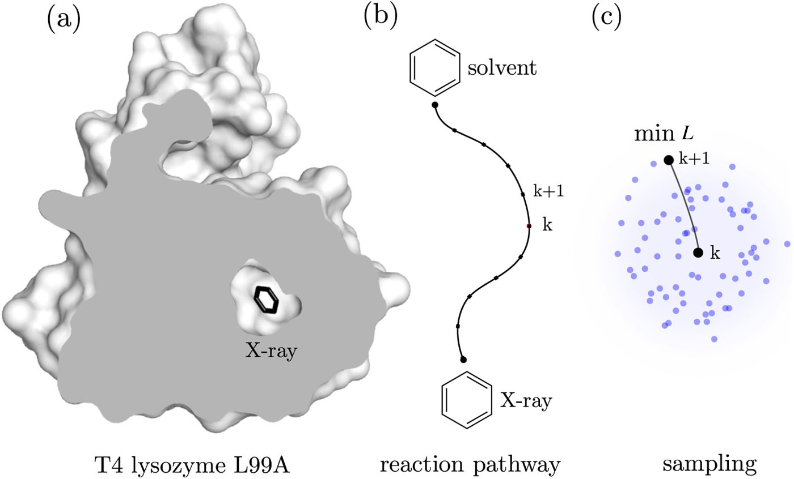

##### [&larr;](NAVIGATION.md)

### Background of `maze`

Searching for reaction pathways describing rare events in large systems presents a long-standing challenge in chemistry and physics. Incorrectly computed reaction pathways result in the degeneracy of microscopic configurations and the inability to sample hidden energy barriers. 

Here, we will explore an enhanced sampling method to find multiple diverse reaction pathways of ligand unbinding by optimizing a loss function describing ligand-protein interactions coarsely. We will examine the method on the T4 lysozyme L99A mutant (T4L), which is often used as a model system to study ligand binding to proteins.

#### Loss Function
Because fluctuations in binding pockets constitute an important feature of protein tunnels, we will use a loss function that scores how deeply buried a ligand is within the protein matrix. The loss function should have a maximum within the protein and decrease to zero as the ligand dissociates to solvent.

For simplicity, we use a coarse model for ligand-protein interactions:

$$
L = \sum_k \frac{e^{-r_k}}{r_0}
$$

where the sum goes over ligand-protein atom pairs in the local neighborhood of the ligand and $r_0$ is a cutoff. The user can choose to use any loss function implemented in PLUMED as a [switching function](https://www.plumed.org/doc-v2.9/user-doc/html/switchingfunction.html).

#### Minimization
The loss function will be minimized using simulated annealing. To this end, the method checks if a randomly chosen neighboring position of the ligand $x$ is preferred in terms of the loss function. The probability of accepting a randomly generated neighbor is given as:

$$
p = \min(1, \mathrm{e}^{-\beta \Delta L}),
$$

where $\Delta L$ is the difference of between the current loss function and the loss function of the neighbor. 

#### Adaptive Biasing
When the optimal unbinding direction $x$ is determined using the minimization method, the ligand is biased towards $x$ within the tunnel. This is accomplished by applying an adaptive harmonic potential:

```math
V(x_{k+1})=h\left(vt - (x - x'_{k})\cdot\frac{x'_{k+1} - x_{k+1}}{\|x'_{k+1}-x_{k+1}\|}\right)^2,
```

where $x'_k$ is the optimal solution at time $k$, $v$ is the
biasing rate, and $h$ is the scale constant. A detailed explanation can be found in [[1]](#1).

<center></center>

*Figure* Unbinding is initiated from the bound state (X-ray binding site) of the T4L-benzene complex and ends once the ligand reaches the solvent. (a) The cross-section through the X-ray structure of T4L shows no apparent tunnels for benzene to leave the protein, which means that the protein must undergo structural changes to open possible exits. (b) A reaction pathway characterizing the unbinding along the exit tunnel is identified locally during MD simulations. (c) To determine the (k+1)-th intermediate, the conformations of benzene are sampled in the neighborhood of the k-th intermediate. Then, from the sampled ligand conformations, the optimal biasing direction is calculated by selecting the ligand conformation with the lowest loss function value.

---

<a id="1">[1]</a>  J. Rydzewski, and O. Valsson, *Finding Multiple Reaction Pathways of Ligand Unbinding* J. Chem. Phys. 150, 221101 (2019) [doi:10.1038/s41592-019-0506-8](https://doi.org/10.1038/s41592-019-0506-8).

---
