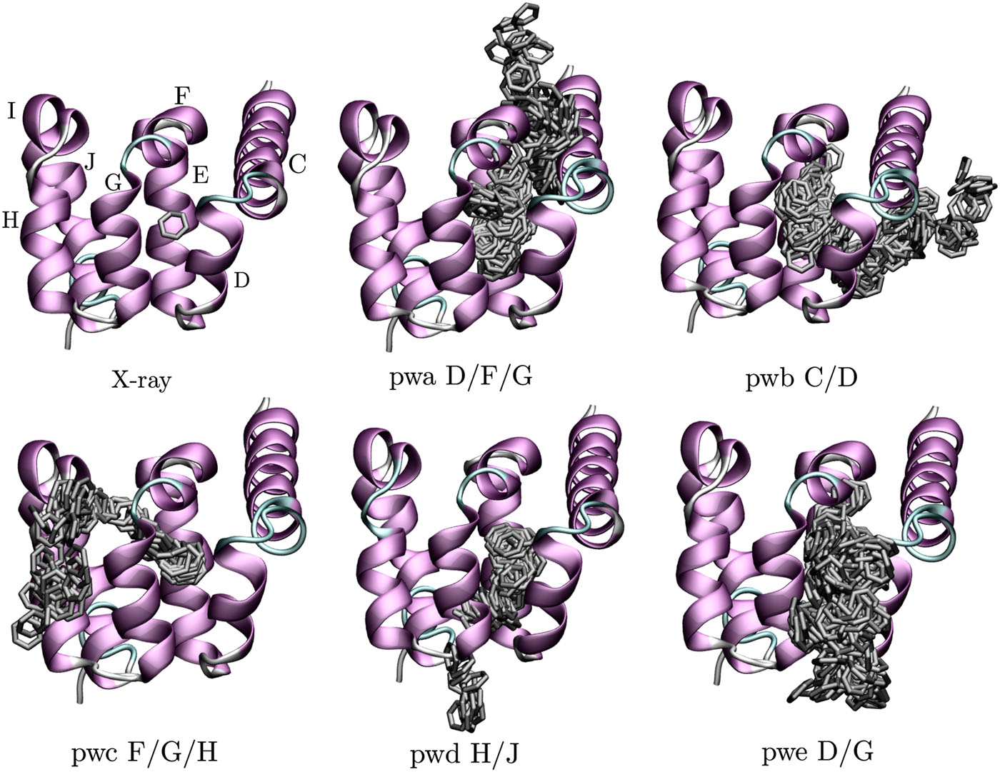
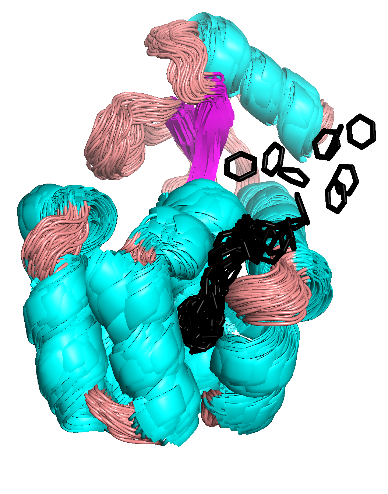
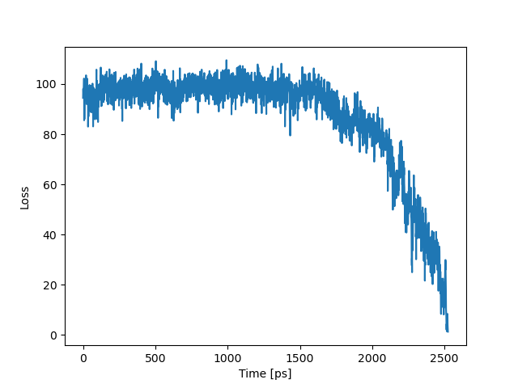
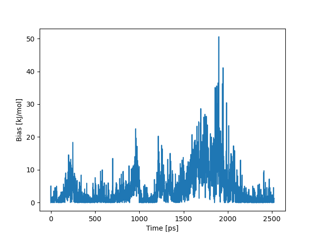

##### [&larr;](NAVIGATION.md)

### Results

In our previous paper [[1]](#1), we ran around 300 short trajectories and identified the dissociation pathways visible in Figure, where each pathway is named pwa, pwd, ..., and by T4L helices through which benzene dissociated. You should be able to obtain one of these pathways using the parameters chosen in this tutorial.

Simulations carried out using `maze` will save two files: `colvar.data` and `optimizer.dat`. The `colvar.data` file contains all the information that we want to print using the `PRINT` action of PLUMED, while the `optimizer.dat` file contains data related to the optimization results.

This simulation ended around 2.5 ns and resulted in an unbinding pathway shown below. The pulling direction was optimized three times (at 0, 1, and 2 ns). See the figure below for overlayed conformations of the T4L-benzene complex sampled during the simulation.

The next figure shows how the loss function behaves in time. We can see that beginning from 1.5 ns, it starts to decay to zero. This point also coincides with the peak in the bias potential, suggesting that this is the point where benzene overcomes the highest energy barrier.

Such benzene dissociation pathways can be later used to define reference frames for path collective variables to run a metadynamics simulation with which a free-energy profile can be calculated. For details on this, please see [here](https://www.plumed.org/doc-v2.9/user-doc/html/_p_a_t_h.html).

---

<a id="1">[1]</a>  J. Rydzewski, and O. Valsson, *Finding Multiple Reaction Pathways of Ligand Unbinding* J. Chem. Phys. 150, 221101 (2019) [doi:10.1063/1.5108638](https://doi.org/10.1063/1.5108638).